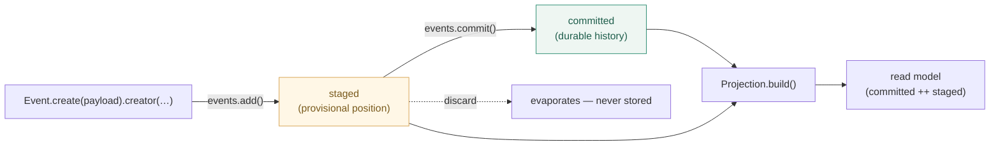

# Aggregates

An aggregate is an in-memory **container for one entity's event stream**. It keeps _committed_ (durable) events apart from _staged_ (proposed) ones, and enforces **no business rules** — it is a faithful container, never a consistency boundary.

If the committed/staged distinction is new to you, start with the [mental model](/concepts).

## Define an aggregate and register its events

```ts
import { aggregate } from "@hilaryosborne/sourcing";

export const Account = aggregate("account");
Account.register(AccountOpened);
Account.register(AccountDeposited);
Account.register(AccountWithdrawn);
```

- `aggregate(name): AggregateDefinition`. The name is identity (used in event references and as the stream's `name`).
- `register(eventDef)` declares an event topic legal on this aggregate and chains. Registering the **same topic twice** on one definition throws `AggregateErrors.TOPIC_DUPLICATE`.
- Events are standalone — the same definition can be registered on other aggregates too. See [Events](/guide/events) for how event definitions are built.

## Create an instance

```ts
const fresh = Account.instance(); // core mints a nanoid id
const known = Account.instance("acc-1"); // or supply your own id
```

`instance(id?)` returns an `AggregateInstance` with empty `committed`/`staged`. **Ids are minted by core by default** (the same nanoid mechanism events use), so an aggregate is identifiable without ever touching storage.

Identity is exposed as plain properties: `instance.id`, `instance.name`, and `instance.position` (the head — highest position across committed+staged, or `undefined` when empty).

## Stage events through `instance.events`

```ts
const account = Account.instance("acc-1");

account.events.add(AccountOpened.create({ holder: "Ada" }).creator("user", "ada"));
account.events.add(AccountDeposited.create({ amount: 100 }).creator("user", "ada"));

account.events.staged.length; // 2  (proposed, not yet committed)
account.events.committed.length; // 0
account.position; // 1  (head)

account.events.commit(); // fold staged → committed (in-memory bookkeeping; core stores nothing)
account.events.committed.length; // 2
account.events.staged.length; // 0
```



The `events` namespace:

| Member              | Does                                                                                                                        |
| ------------------- | --------------------------------------------------------------------------------------------------------------------------- |
| `add(event)`        | Stage a standalone event: stamps its **provisional position** (next index) + aggregate ref, pushes to `staged`, returns it. |
| `committed`         | The durable history (a copy).                                                                                               |
| `staged`            | The proposed, not-yet-committed events (a copy).                                                                            |
| `import(envelopes)` | Load durable history into `committed` (rehydrates each envelope). Returns the instance.                                     |
| `export()`          | Return `committed ++ staged` as plain validated envelopes, in position order.                                               |
| `commit()`          | Fold `staged` into `committed` in memory. Models the state _after_ the repository persisted them.                           |

`add()` throws `AggregateErrors.TOPIC_UNKNOWN` if the event's topic isn't registered here, and `AggregateErrors.MISSING_CREATOR` if the event carries no provenance.

::: warning
`commit()` does not persist anything — core has no storage. It's the in-memory split-bookkeeping step. When you use the repository, `repo.commit(aggregate)` persists _and_ folds for you. See [Storage adapters](/guide/storage-adapters).
:::

## Preview a would-be state, then decide

The committed/staged split exists for exactly this: stage without committing, build the projection, judge it.

```ts
account.events.import(history); // committed, balance = 100
account.events.add(AccountWithdrawn.create({ amount: 250 }).creator("user", "ada")); // staged only

const wouldBe = Balance.build(account); // folds committed ++ staged → balance -150
if (wouldBe.balance < 0) {
  // your rule. Reject — never commit. The staged withdrawal evaporates.
} else {
  account.events.commit();
}
```

The library computed the would-be balance; the overdraw rule is entirely yours. See [Projections](/guide/projections) for how `build` folds events into state.

## Import history (rehydrate)

```ts
const account = Account.instance("acc-1");
account.events.import(envelopes); // each envelope is validated + restored into `committed`
```

`import` throws `AggregateErrors.TOPIC_UNKNOWN` for an envelope whose topic isn't registered, and `AggregateErrors.EVENT_INVALID` (with the Zod error as `cause`) for one that fails its schema. The next staged event continues the stream's positions.

## Right-to-forget (pure core)

```ts
const redacted = account.strip("gdpr"); // a NEW aggregate instance
```

`strip(context)` walks committed + staged, applies each event's matching named stripper, and returns a **new** aggregate — same ids, positions, topics, and metadata, with redacted payloads. Nothing is mutated in place; events with no matching stripper pass through. The pass/fail test: `redacted.events.export()` contains no PII. (With storage, prefer `repo.forget(...)`, which also overwrites and bins projections — see [Storage adapters](/guide/storage-adapters).)

## Errors aggregates raise

| Error                             | When                                                                   |
| --------------------------------- | ---------------------------------------------------------------------- |
| `AggregateErrors.TOPIC_DUPLICATE` | `register()` got a topic already registered on this definition.        |
| `AggregateErrors.TOPIC_UNKNOWN`   | `add()`/`import()` got an event whose topic isn't registered here.     |
| `AggregateErrors.MISSING_CREATOR` | `add()` got an event with no `creator`.                                |
| `AggregateErrors.EVENT_INVALID`   | `import()` got an envelope that fails its schema (`cause` = ZodError). |

## Gotchas

- **The aggregate never rejects on business grounds.** If you expected it to block an "illegal" event, that belongs in your app around the staged-preview step, not in the aggregate.
- **Provisional positions collide by design.** Two processes staging onto separately-loaded copies both assign the same next index — reconciling that is the repository's optimistic-concurrency job at commit, not core's.
- **`commit()` ≠ durability.** In core it's memory only; durability is the repository's `commit`.
