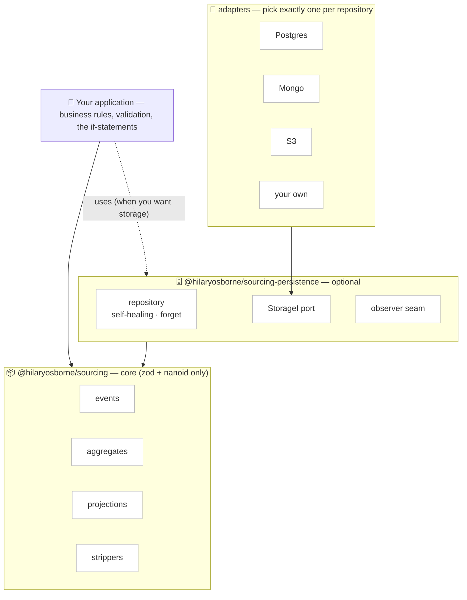
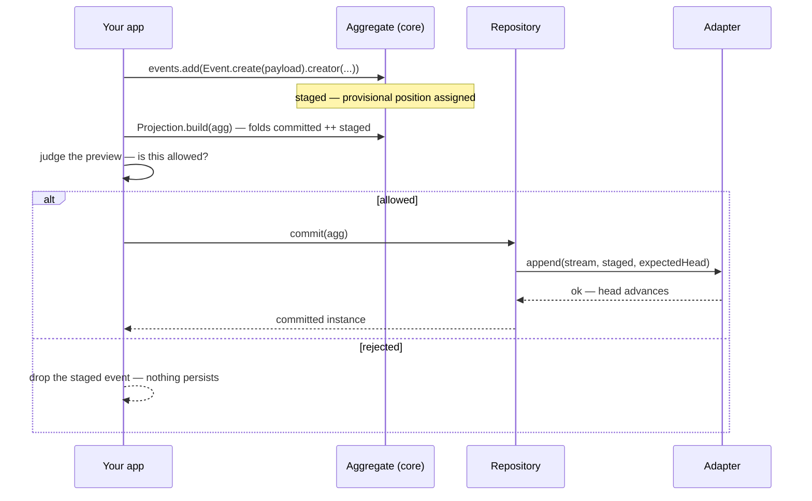
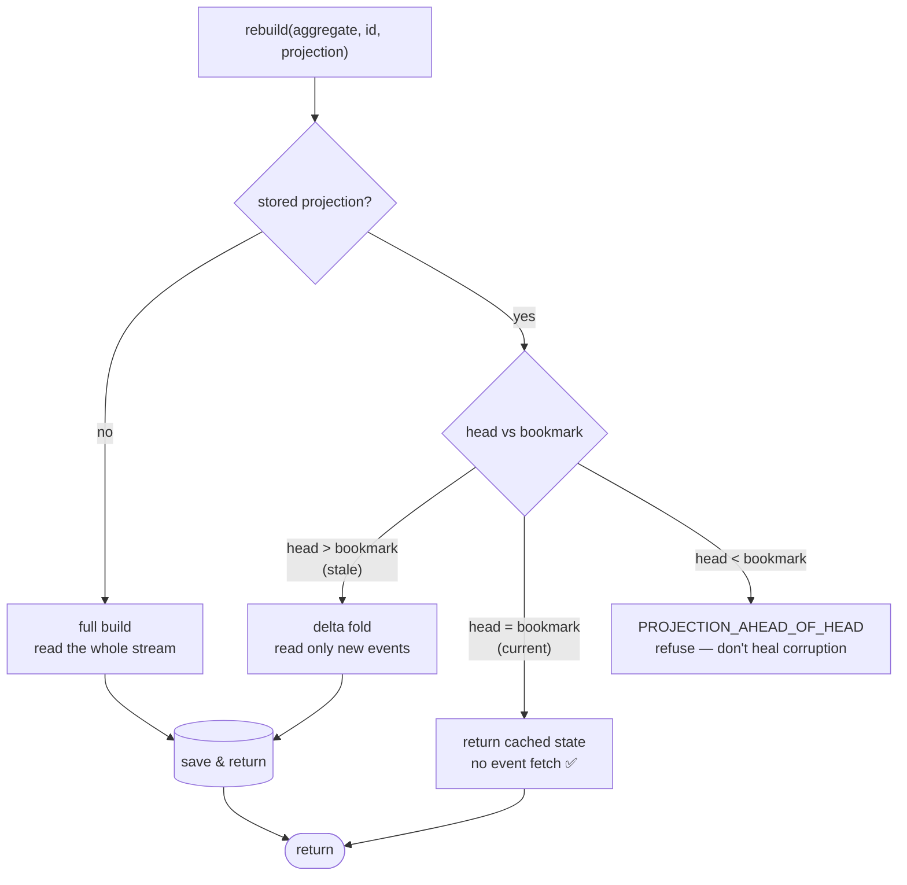

# 🏗️ Architecture at a glance

One page to see the whole shape: what the packages are, how they depend on each other, and how data flows through a write and a read. For the _why_ behind these choices, read [The mental model](/concepts); for the exact signatures, the [API reference](/reference/api-core).

## The layers

The library is three layers, and the dependency arrows only ever point **downward**. Your business rules sit on top; the core knows nothing about storage; the persistence layer depends on core; adapters depend on the persistence port. Nothing points back up.

What that buys you:

- **Core runs with no database at all.** Define events, fold projections, preview staged state — all in memory. Two dependencies, zero storage concepts. ([Quickstart →](/guide/getting-started))
- **Persistence is opt-in.** Reach for it only when you want events _stored_ and projections kept current. It depends on core; core never learns it exists.
- **Adapters are swappable.** One `StorageI` interface, certified by a shared [conformance suite](/reference/api-persistence#conformance). If it passes on S3, it works anywhere.

| Package                                                         | What it owns                                                     | Depends on      |
| --------------------------------------------------------------- | ---------------------------------------------------------------- | --------------- |
| `@hilaryosborne/sourcing`                                       | events, aggregates, projections, strippers                       | `zod`, `nanoid` |
| `@hilaryosborne/sourcing-persistence`                           | repository, self-healing, the `StorageI` port, the observer seam | core            |
| `@hilaryosborne/sourcing-adapter-postgres` \| `-mongo` \| `-s3` | one concrete backend                                             | persistence     |

## The write path

Writing is _append a fact_. The twist that makes business rules possible without a rule engine: you can **stage** an event, preview the would-be state, and decide in your own code before committing.

The library answers _"what would the state be?"_; your app answers _"is this allowed?"_. If two writers race, `append`'s expected-head guard means exactly one wins and the other gets a [`VERSION_CONFLICT`](/reference/error-index#persistence-storageerrors) to retry. ([Staged validation →](/guide/use-cases#enforce-a-business-rule-without-a-rule-engine))

## The read path: self-healing

Reading is _fold the facts into a read model_. The repository keeps a cached projection and, on every `rebuild`, does **one cheap head read** to take the cheapest correct path — so a current read costs almost nothing.

Because projections are pure folds that hold no truth of their own, you can bin one and rebuild it any time — which is exactly what makes [right-to-forget](/guide/right-to-forget) tractable: redact the events, bin the projections, rebuild clean.

## The three ways to use it

Same core aggregate and projection builder throughout — only _who fills the aggregate_ changes:

1. **In-memory** — you fill the aggregate from events you already hold; fold and return. Core only. ([example →](/guide/use-cases#turn-events-into-a-read-model-with-zero-infrastructure))
2. **Stored & self-healing** — the repository fills the aggregate from storage; `rebuild` keeps projections current. ([example →](/guide/use-cases#persist-projections-that-keep-themselves-current))
3. **Staged overlay** — preview not-yet-committed events on top of stored state for validation. ([example →](/guide/use-cases#enforce-a-business-rule-without-a-rule-engine))

The core cannot tell these apart, and that is the point.

## ➡️ Next

- [The mental model](/concepts) — the _why_ behind the boundaries above.
- [Quickstart](/guide/getting-started) — build the in-memory path in 60 seconds.
- [API: core](/reference/api-core) · [API: persistence](/reference/api-persistence) — the exact surface.
