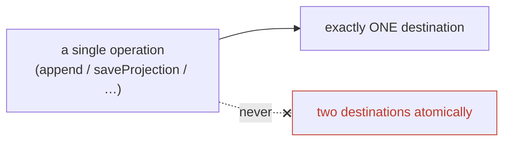

# 🗺️ Spreading storage (destinations)

The library targets **one adapter per repository** — but within that adapter, you choose _where_ each kind of data lives, and you're free to spread data across stores yourself. The seam is the optional `destinations` map, and the rule behind it is small and strict: **configurable, never coordinated.**

## The `destinations` map

Every adapter factory takes an optional map naming where each kind goes. An adapter reads each name as a table, collection, or key-prefix:

```ts
const storage = await postgresStorage(pgClient, {
  events: "account_events", // where the event streams live
  projections: "account_projections", // where cached projections live
  registry: "account_events", // where head is read — defaults to `events`
});
```

| Destination   | Used by                                                                            | Default                |
| ------------- | ---------------------------------------------------------------------------------- | ---------------------- |
| `events`      | `head` · `read` · `append` · `overwrite`                                           | required               |
| `projections` | `loadProjection` · `saveProjection` · `deleteProjections` (and `forget`'s bin-all) | required               |
| `registry`    | reading a stream's head for self-healing                                           | falls back to `events` |

The `registry` is a _view_ over the event head, so by default it reads from `events`. You only set it separately for a backend that materialises the registry elsewhere — and even then it's a **location**, not a different meaning.

## The rule: one destination per operation, never across

The library performs each operation against exactly one destination and **never coordinates a single operation across two**. Pointing projections at a different table from events is fine; expecting an append-and-save to be atomic across two stores is not — that's distributed transactions, which the library deliberately doesn't pretend to offer.



This is why **spreading a stream across stores is your plumbing, not the library's.** You can absolutely put account events in one place and order events in another, or events in Postgres and a search projection in Elasticsearch — but the coordination (and any cross-store consistency you need) lives in _your_ code, behind your own composition of repositories. The library's job is to never silently make a promise it can't keep across a boundary.

## What every adapter guarantees regardless

Two capabilities are mandatory on _every_ adapter, at every destination, so the spread never weakens them:

- **Optimistic concurrency** — `append` is a real compare-and-append. ([VERSION_CONFLICT →](/reference/error-index#persistence-storageerrors))
- **In-place overwrite** — for [right-to-forget](/guide/right-to-forget), so PII can be redacted wherever events live.

If you spread events across two adapters, each still enforces these on its own streams; what you don't get is a _single_ transaction spanning both. That's the honest line: non-prohibition, not coordination.

## ➡️ Next

- [Storage adapters](/guide/storage-adapters) — the shipped adapters and the decision matrix.
- [Write your own storage adapter](/guide/write-own-adapter) — implement `StorageI` for a new backend.
- [The repository & self-healing](/guide/repository) — what reads the registry and writes projections.
