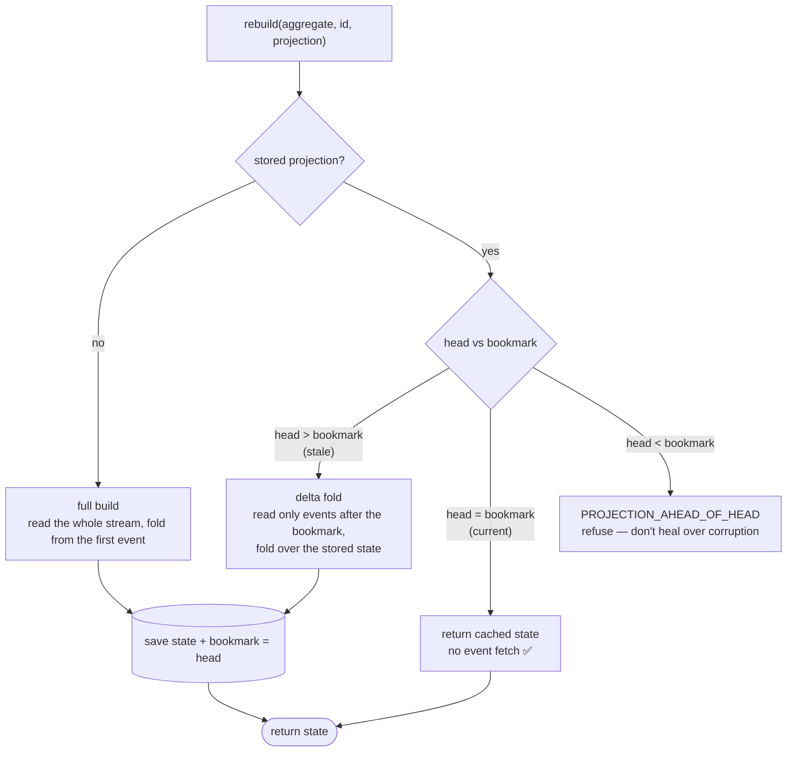
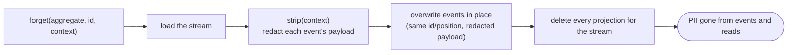

# ♻️ The repository & self-healing

Core has no storage. The **repository** (`@hilaryosborne/sourcing-persistence`) is the layer that adds the stored read/write path on top of it — the write path, the self-healing read, and the right-to-forget sequence — over whichever [storage adapter](/guide/storage-adapters) you inject. It's the same core aggregate and projection builder underneath; the repository just fills the aggregate from storage instead of you filling it by hand.

## Compose it

```ts
import { repository } from "@hilaryosborne/sourcing-persistence";

const repo = repository({ storage }); // storage is a StorageI from one adapter
```

`repository({ storage })` wires the aggregate registry and projection store from that one adapter — you choose only the backend. Pass an optional `observer` to instrument every operation ([Observability →](/guide/observability)).

## The surface

| Method                                                      | Does                                                                                          |
| ----------------------------------------------------------- | --------------------------------------------------------------------------------------------- |
| `create(definition)` → `Promise<instance>`                  | A fresh, empty aggregate instance (core mints the id). Nothing persisted until `commit`.      |
| `load(definition, id)` → `Promise<instance>`                | Read the full stream and import it into `committed`, ready for more staging.                  |
| `commit(instance)` → `Promise<instance>`                    | Append staged events under optimistic concurrency, advance the head, fold staged → committed. |
| `rebuild({ aggregate, id, projection })` → `Promise<State>` | The self-healing read (below); heals the stored projection as a side effect.                  |
| `forget({ aggregate, id, context })` → `Promise<void>`      | Load → `strip(context)` → overwrite events in place → bin every projection for the stream.    |

## The write path, and the retry loop

Writing is `create`/`load`, stage events, `commit`. Commit appends under an **expected-head guard** — if another writer advanced the stream first, it raises [`VERSION_CONFLICT`](/reference/error-index#persistence-storageerrors) and writes nothing. That's not a fault; it's the signal to retry. The canonical, correct retry **reloads** so the new events stage onto the winner's head:

```ts
import { StorageErrors } from "@hilaryosborne/sourcing-persistence";

async function commitWithRetry<T extends AggregateInstance>(
  load: () => Promise<T>, // fresh instance each attempt
  stage: (aggregate: T) => void, // re-apply your staged events
  attempts = 3,
): Promise<T> {
  for (let attempt = 1; ; attempt++) {
    const aggregate = await load();
    stage(aggregate);
    try {
      return await repo.commit(aggregate);
    } catch (err) {
      const conflict = err instanceof Error && err.message === StorageErrors.VERSION_CONFLICT;
      if (conflict && attempt < attempts) continue; // reload → re-stage → retry
      throw err;
    }
  }
}
```

The reload is what makes the retry correct: staged positions are provisional, and re-staging onto a freshly-loaded head re-derives them against reality. Retrying _without_ reloading just loses the same race again.

## Self-healing: the `rebuild` algorithm

Reading is `rebuild`. It keeps a cached projection (state + a **bookmark**, the head position it was last folded to) and, on every call, does **one cheap head read** to take the cheapest correct path:



| Outcome        | Condition               | Cost                          |
| -------------- | ----------------------- | ----------------------------- |
| **full build** | no stored projection    | read the whole stream         |
| **delta fold** | head > bookmark (stale) | read only the new events      |
| **current**    | head == bookmark        | one head read, no event fetch |

Because projections are pure folds holding no truth of their own, the stored projection is just a cache — bin it and `rebuild` re-derives it. The proportion of _current_ outcomes is your cache-hit ratio, observable on `rebuild`'s progress hook ([Observability →](/guide/observability#what-fires-the-exhaustive-op-set)).

::: warning The corruption guard
If a stored projection's bookmark sits _past_ the reachable head, `rebuild` refuses with [`PROJECTION_AHEAD_OF_HEAD`](/reference/error-index#persistence-repositoryerrors) rather than silently heal — it means events vanished from under a stored projection, which warrants investigation, not a quiet rebuild.
:::

## Right-to-forget: the `forget` sequence

`forget` reconciles immutable history with erasure by redacting events in place and binning the projections built from them:



Binning the projections is essential: `overwrite` doesn't move the head, so a _current_ cached projection would otherwise be served from cache and mask the erasure. After binning, the next `rebuild` takes the clean full-build path over the redacted events.

::: warning `forget` completion is an operational obligation
`forget` is idempotent and convergent under retry, but it is **not atomic** across its steps. If it fails _after_ overwrite but _before_ binning, PII can persist in a stale "current" projection. For an operation whose purpose is compliance, **re-run it until it succeeds** — re-running from the top heals any partial-failure state. ([Right-to-forget →](/guide/right-to-forget))
:::

## Errors the repository raises

| Error                                                                                              | When                                                                                           |
| -------------------------------------------------------------------------------------------------- | ---------------------------------------------------------------------------------------------- |
| [`StorageErrors.VERSION_CONFLICT`](/reference/error-index#persistence-storageerrors)               | `commit` lost an optimistic-concurrency race. Normal — reload, re-stage, retry.                |
| [`RepositoryErrors.PROJECTION_AHEAD_OF_HEAD`](/reference/error-index#persistence-repositoryerrors) | A stored projection's bookmark sits past the reachable head — refuses to heal over corruption. |
| [`StorageErrors.OVERWRITE_UNKNOWN_POSITION`](/reference/error-index#persistence-storageerrors)     | `forget`/overwrite targeted a `(stream, position)` that isn't stored.                          |

## ➡️ Next

- [Storage adapters: overview & choosing](/guide/storage-adapters) — pick a backend.
- [Postgres](/guide/adapter-postgres) · [Mongo](/guide/adapter-mongo) · [S3](/guide/adapter-s3) — wire one up.
- [Observability](/guide/observability) — see every operation, including the cache-hit ratio.
