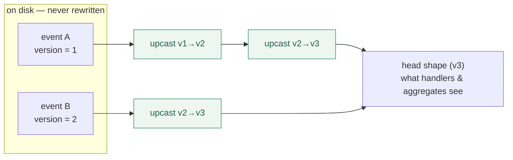

# 🔢 Versioning & upcasters

Payloads change. A field you didn't need becomes required; a flat shape grows nested; a typo in a key gets fixed. In a CRUD system that's a migration against live data. Here it's a **declared, read-time transform** — old events are never rewritten, and your projections only ever see the latest shape.

This is the deep-dive. For the quick version, the [Events guide](/guide/events#versions-upcasters-evolving-a-payload) has the essentials; this page is the strategy, the mechanics, and the honest answer to _"what happens when an event has 87 versions?"_

## The model in one diagram

An event definition is an ordered list of versions. Every stored event records the **1-based ordinal** it was written at. At read time, the library walks that event forward through your upcasters to the **head** (latest) shape — so consumers never see an old shape, and storage is never touched.



The **upcast chain** runs forward only, in memory, every read. `build()` still returns the faithful stored form for persistence — upcasting is for consumption, not rewriting.

## Declaring a version and its upcaster

The first version has no upcaster (nothing precedes it). Every later version declares one that lifts the previous shape into it:

```ts
import { event } from "@hilaryosborne/sourcing";
import { object, string } from "zod";

export const AccountOpened = event("account.opened");

// v1 — the original shape
AccountOpened.version(1, object({ holder: string().min(1) }));

// v2 — nested the holder, added a country
AccountOpened.version(2, object({ holder: object({ name: string().min(1) }), country: string().min(1) })).upcast(
  (prev) => {
    const v1 = prev as { holder: string };
    return { holder: { name: v1.holder }, country: "unknown" };
  },
);

// v3 — renamed country → countryCode
AccountOpened.version(3, object({ holder: object({ name: string().min(1) }), countryCode: string().length(2) })).upcast(
  (prev) => {
    const v2 = prev as { holder: { name: string }; country: string };
    return { holder: v2.holder, countryCode: v2.country === "unknown" ? "ZZ" : v2.country.slice(0, 2).toUpperCase() };
  },
);
```

A v1 event read today runs `v1 → v2 → v3`; a v2 event runs `v2 → v3`; a v3 event runs as-is. Every consumer sees the v3 shape.

- **The upcaster's input is `unknown`** — the definition can't thread the previous version's type through separate statements, so narrow it (`prev as …`) against the shape you're lifting _from_. Its **return** is validated against the new version's schema; a mismatch is [`UPCAST_INVALID`](/reference/error-index#core-eventerrors) at read time.
- **New events are born at head.** `AccountOpened.create(...)` always takes the latest shape.

## Which tool: version, new topic, or just add a field?

Not every change needs a version. Pick by what actually changed:

| Change                                                 | Reach for                      | Why                                                                                                                 |
| ------------------------------------------------------ | ------------------------------ | ------------------------------------------------------------------------------------------------------------------- |
| Add an **optional** field, or widen a type             | nothing — just edit the schema | Old payloads still validate; no upcast needed.                                                                      |
| Add a **required** field, rename, nest, or restructure | **a new version + upcaster**   | Old payloads don't satisfy the new schema; the upcaster supplies the difference.                                    |
| The event now means something **genuinely different**  | **a new topic**                | Versioning evolves _one fact's shape_; a different fact is a different topic, handled by its own projection mapper. |

The trap to avoid is **parallel topics for what is really one fact** — `account.opened.v2` as a separate topic forces every projection to branch on which one fired, forever. A version keeps it one topic and lifts the old shape automatically.

## "What happens when an event has 87 versions?"

A real question, and the honest answer has two halves.

**It works, and it's cheap where it matters.** An 87-version event is an 87-link chain of small pure functions. A stored v12 event lifts `v12 → … → v87` on read. But that cost lands at **build time**, not on every read: the [self-healing repository](/guide/repository#self-healing-the-rebuild-algorithm) folds and upcasts once, caches the projection, and on the _current_ path returns it with **no event fetch and no upcasting at all**. So a long chain taxes a cold rebuild, never your hot read path.

**The honest sharp edges:**

- **The chain only ever grows.** You can't drop a version while any event written at it still exists — the chain has to keep lifting it forward. A later version left without an upcaster throws [`UPCAST_MISSING`](/reference/error-index#core-eventerrors) at first use.
- **87 is usually a smell.** By the time an event has evolved 87 times, it's often trying to be too many different facts. Most of those should have been **new topics**, not new versions of one. Reach for a version when the _shape_ of the same fact changed; reach for a new topic when the _meaning_ changed.
- **There's no on-disk migration to "collapse" the chain.** That's the deliberate trade: nothing is ever rewritten, so the chain is the price of never running a migration. If you truly need to retire old versions, you re-emit the stream into a fresh aggregate with the head shape — an application-level choice the library doesn't impose.

The library stays purely mechanical about all of it: it counts ordinals and runs your functions in order. It never interprets what a version _means_.

## The rules (runtime mechanical faults)

Versioning invariants are enforced at runtime, not by the type system:

| Fault                                                                | Triggered by                                                                                            |
| -------------------------------------------------------------------- | ------------------------------------------------------------------------------------------------------- |
| [`VERSION_SEQUENCE`](/reference/error-index#core-eventerrors)        | `.version(n, …)` that isn't `1, 2, 3, …` — wrong start, gap, or duplicate.                              |
| [`UPCAST_ON_FIRST_VERSION`](/reference/error-index#core-eventerrors) | `.upcast()` on version 1 — nothing precedes it.                                                         |
| [`UPCAST_MISSING`](/reference/error-index#core-eventerrors)          | A version ≥ 2 declared without an upcaster (lazy — at first use).                                       |
| [`UPCAST_INVALID`](/reference/error-index#core-eventerrors)          | An upcaster's output fails the version's schema, on read.                                               |
| [`VERSION_UNKNOWN`](/reference/error-index#core-eventerrors)         | A stored ordinal isn't declared on the definition's chain (restoring against the wrong/old definition). |

## Strippers are per version

[Right-to-forget](/guide/right-to-forget) strippers are registered on the version whose shape they redact — they don't compose along the upcast chain. Each stored event is redacted in its _own_ version's vocabulary, then (on read) still upcasts to head. The two chains decouple completely: because a stripper's output is re-validated against its version's schema, an upcaster downstream is always handed a valid input.

```ts
// each version owns its redactor — they don't chain
AccountOpened.version(1, object({ holder: string().min(1) })).strip("gdpr", (p) => ({ holder: "[redacted]" }));
AccountOpened.version(2, object({ holder: object({ name: string().min(1) }), country: string().min(1) }))
  .upcast(/* … */)
  .strip("gdpr", (p) => ({ ...p, holder: { name: "[redacted]" } }));
```

## Testing your upcasters

An upcaster is a pure function — test it as one. The highest-value test folds a **mixed-version stream** and asserts every event arrives at head shape:

```ts
// a stream with a v1 and a v2 event, restored and folded
const account = Account.instance(id);
account.events.import([storedV1Envelope, storedV2Envelope]); // both lift to v3 on read
const view = Profile.build(account); // handlers only ever see v3 — assert against that
```

Test each upcaster's output against the next schema in isolation, and test the _whole chain_ by importing an old-ordinal envelope and reading head. A stripped-then-upcast event is worth a test too: redact at v1, confirm it still lifts to a valid head shape.

## ➡️ Next

- [Events](/guide/events) — the full event surface.
- [The repository & self-healing](/guide/repository) — where the upcast cost is amortized.
- [Right-to-forget](/guide/right-to-forget) — per-version strippers in depth.
